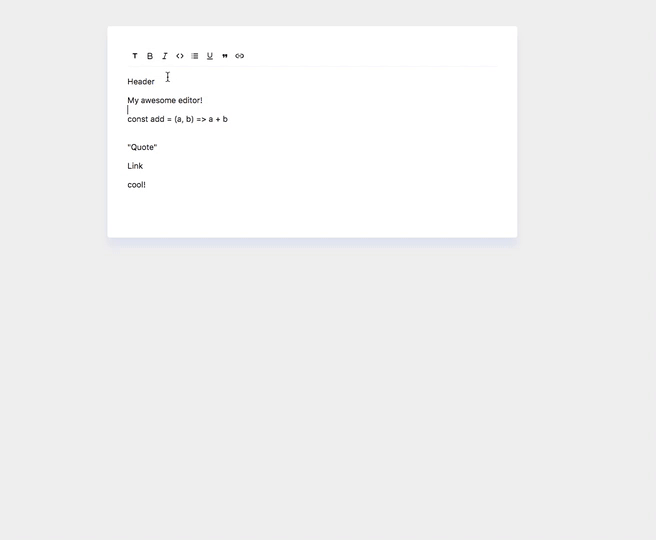

# 1. Editor de texto

	

El objetivo de un editor de texto es reducir los esfuerzos de los usuarios que intentan convertir su formato como marcado HTML válido. Un buen editor de texto permite a los usuarios formatear texto de diferentes maneras.

En algún momento, todos usaron un editor de texto. Entonces, ¿por qué no crearlo usted mismo ?
